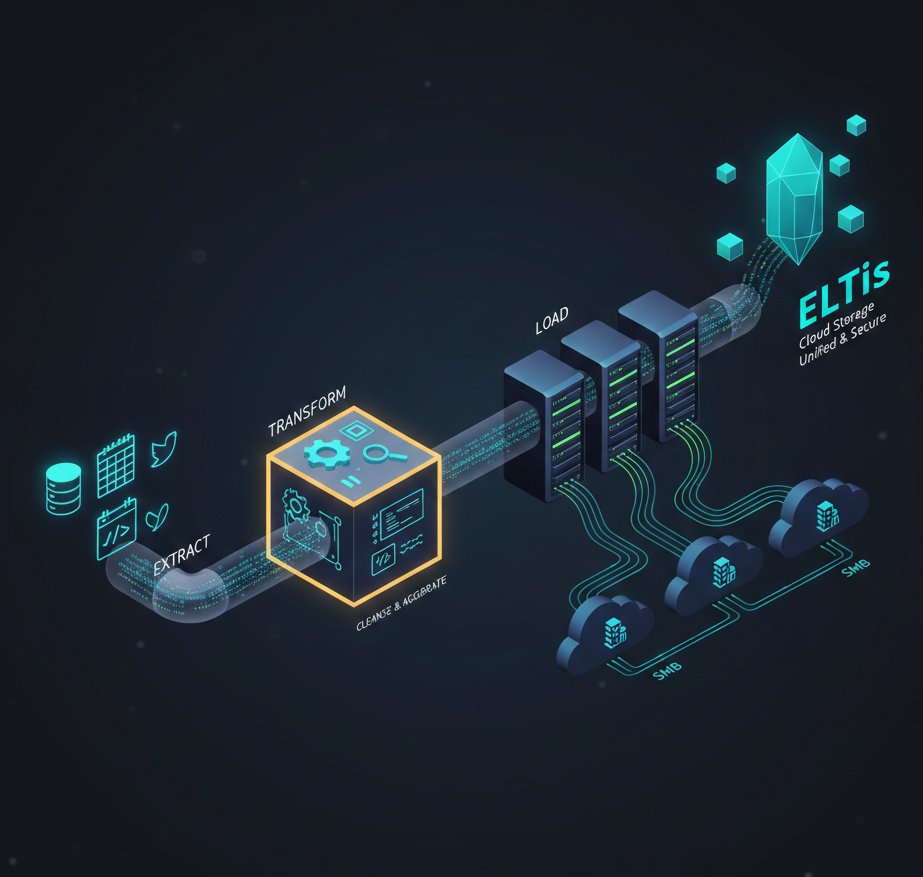

# Project: Automated Data Pipeline & ETL for SMBs | Marec Insights

**Case Study:** Strategic Data Remediation for [Industry]

This project demonstrates a full-scale **Automated Decision Engine** built by **Mark Anthony Recio**. It addresses the common SMB challenge of data silos and manual reporting.

### 💰 ROI & Business Value
* **Efficiency:** Automated 15+ hours of manual data consolidation per week.
* **Visibility:** Real-time **Power BI Decision Suite** for 24/7 executive oversight.
* **Scalability:** Built using **Python and SQL** to grow without increasing licensing costs.

### 🧩 System Architecture

1. **Extraction:** Secure API connections to CRM and ERP data.
2. **Transformation:** Data normalization using **Pandas (Python)** and **R**.
3. **Visualization:** Interactive dashboards hosted on **marec.site**.

---
*For the full strategic roadmap, visit [marec.site](https://marec.site).*
